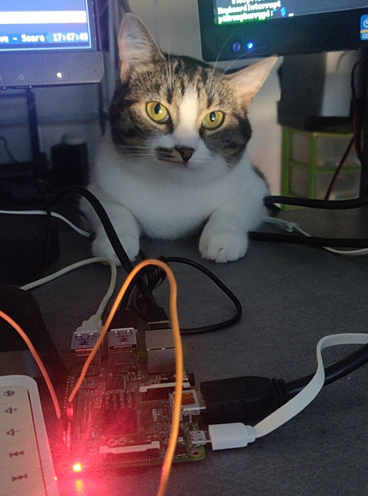
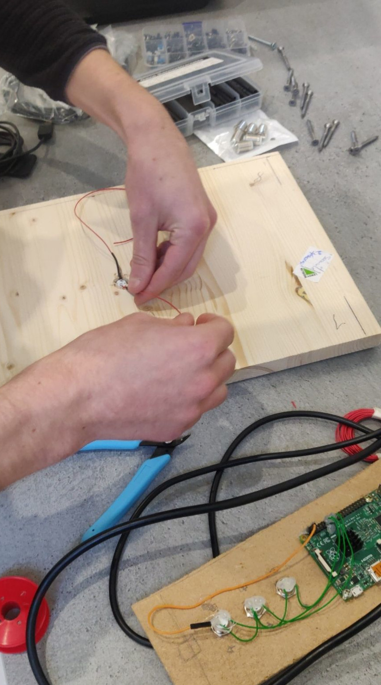
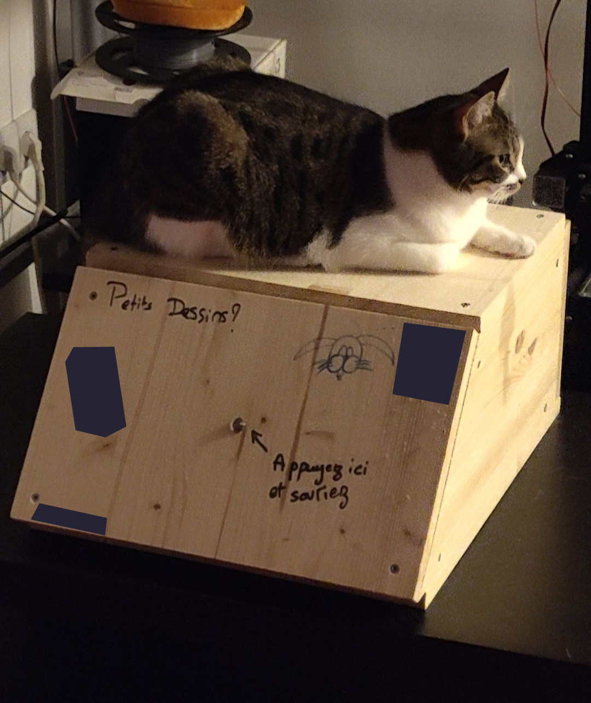

An appliance for parties? Why? How did it come to be?

<!-- truncate -->

A few years ago, back in late 2021, a good friend of mine asked me if I'd be able to build a simple photobooth for his girlfriend's birthday party. Tinkerer's mindset, I just said "it will be done."

I never thought I'd get so passionate about this project. It quickly evolved from a [small proof of concept in python](https://github.com/oxodao/photobooth-legacy) quickly cobbled together on a Raspberry Pi, an Arduino and a webcam in a few lines of code to a much larger project.

This PoC was a success, doing exactly what it was made for, but it was SLOW. REALLY SLOW.

I then started a rewrite in Golang with React, technologies I'm much more familiar with than pygame and even though it might be arguable to use a web browser for an appliance, it was the right call.

The first new feature I had in mind was the timelapse. What if this appliance was taking picture by itself every five minutes and generated a timelapse at the end ? So I added it.

Then came the karaoke, which required a bit more thought...

> Let's add a karaoke feature ! It will be fun !
>
> But wait, I need the users to be able to choose a song... Let's make a backend for them to enqueue the songs
>
> But wait, what if we don't have internet? The photobooth needs to make its own wifi hotspot !
>
> But wait, the RPi 3 doesn't seems to handle displaying the webcam, the audio, the parsing of the CDG file that well at the same time, let's put a full computer in there (To be fair, it might be my code's fault)
>
> But wait, I need microphones, so I need to tinker with PulseAudio to have a loopback (spoiler: it never worked, we used an external microphone, but I'm determined to make it work with this new release)
>
> But wait, singing is cool but why not add the singer voice on a different channel so that we can set the volume of it however we want, to help on songs we don't know well enough?
>
> But wait, what if the background still showed the webcam so it can still be used as a photobooth **while** singing ? And keeping the timelapse feature during karaoke session?
>
> But wait ...

Oh while we're at it, now that the photobooth needs to be hooked up to speakers, why would we even need a separate device to listen to music ? There's this Spotify Connect client that would work well..

Yeah, that quickly got out of hands. But in the end, it became a real novelty for our parties and helped create a lot of memories.

A few month ago, I got enough comprehension about my own project that I decided to rewrite it all to be cleaner, adding the server syncing so that I don't have to link zip file to everyone, and that I can wipe the appliance whenever I want (and it will keep the song library synced automatically).

At the time I'm writing this blog post, I am nearly done with the rewrite but I'm not done with the feature set I want to include.

Here's the next things I'm planning to work on once everything is working properly, in no particular order:
- Quiz: I already 3d printed 4 buzzers but never got them to work how I want
- Blind test: Since we already have a Spotify client, why wouldn't we use it to make a game
- Hardware flash: Blinking the screen white is ok-ish, but a real hardware flash to take picture would be better!
- Lighting & fog machine: The karaoke is neat, but what if we synchronized light and a fog machine to the sound of the songs ?

Here are some early pictures of when we built the hardware for the PoC (also with my cat *Rose*):

