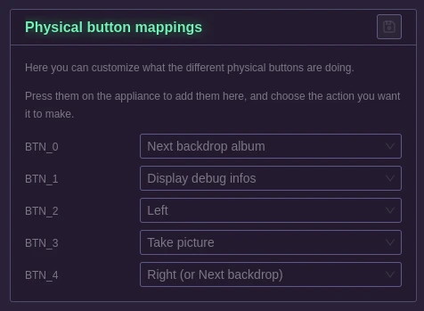

# Button mappings

When you get to this page, the appliance will go in a special mode: It will deactivate all button presses.

The first time you get there, no button will be displayed.

Simply press one on your appliance for it to show up, and assign an action to it.

Repeat the process for every button you have on your appliance.

The last pressed button will have a glow around its name so that you can find it easily.

Possible actions:
- Take picture: This will trigger a standard picture taking.
- Next backdrop album: This will change the currently selected backdrop album for the next one that was synchronized.
- Display debug info: This will show a simple screen on your appliance with a lot of details, among them there is the IP addresses, and a QR code for the Wifi access point.
- Shutdown appliance: Let the appliance shutdown gracefully.
- Left: Currently unused, it will be helpful when some menus are implemented directly on the appliance.
- Right (or next backdrop): This will go to the next backdrop available in the currently selected album.

