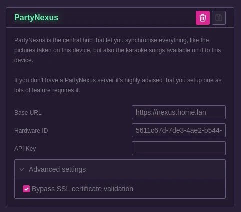

# PartyNexus

Here you're able to setup the PartyNexus hub settings.

The base URL is the url of the hub.

The Hardware ID and Api Key can be found on your admin account settings in PartyNexus, see [this page](/docs/partynexus/appliances/) to set it up.

You can use the `Bypass SSL certificate validation` if you know what you are doing. In most case this should not be required as you probably have a Let's Encrypt certificate set up and it will work out of the box.

Note that the API Key will not be visible the next time you come on this page and should be entered again if you change the settings. This is a security feature.

