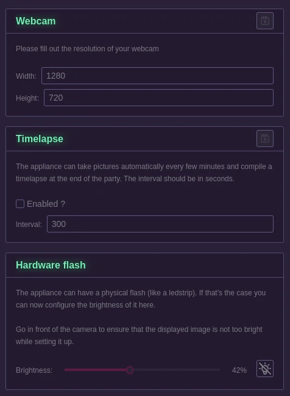

# Photobooth

This page will let you setup everything related to the photobooth feature.

## Webcam

This section lets you specify the resolution of your webcam. It's useful to get great quality out of the pictures taken.

## Timelapse

This section let you specify if you want the appliance to automatically take pictures during the event (stored separately of the standard pictures) that will be compiled as a short timelapse at the end of the event.

The interval should be specified in seconds.

For a party that goes from ~ 8pm to 4am a great value is somewhere around 3-5 minutes between each pictures.

## Hardware flash

If your appliance has an hardware flash (ledstrip linked with the mosfet to the ESP32), you will want to set it up here so that it is used properly when a picture is taken.

Using the button on the right you can turn the ledstrip on, then play aroundwith the value of the slider to find a brightness that gives you the best light exposition. This settings is saved automatically, no need to press any floppy icon.

