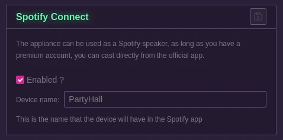

# Third Party intergrations

Currently, only one third-party integration is available: Spotify Connect.

You can define here a name for the appliance to show up in the official Spotify app as a speaker.

Note that the [spotifyd](https://github.com/Spotifyd/spotifyd) software used for this requires the name to NOT have spaces in it.

Also note that this requires a PREMIUM Spotify account and will not work with a free one.

Here's what it looks like in the offical Spotify client for desktop:

