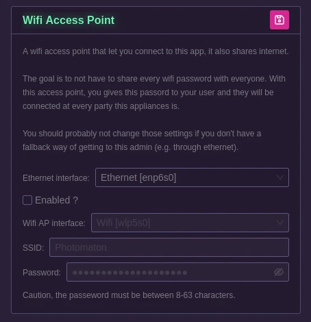

# Wireless access point

This section let you tell your appliance to act as a Wifi access point.

The goal is to not have to share every wifi password with everyone. With this access point, you gives this passord to your user and they will be connected at every party this appliances is.

The ethernet interface is used so that the people connected to the appliance's hotspot have access to the internet.

The Wifi AP interface is the one that will be used to broadcast the signal.

When enabled, in the debug screen you'll be able to show the settings for easy connection of your users:

