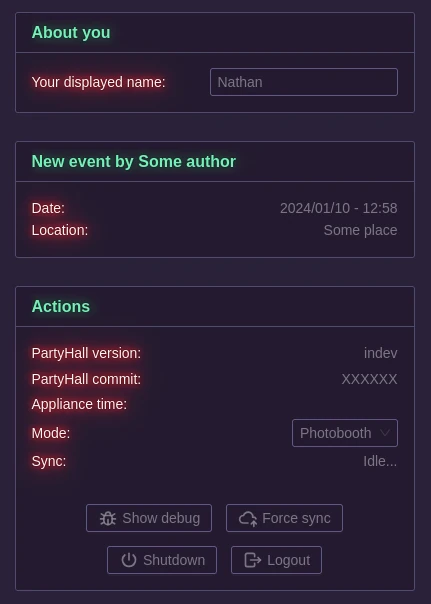

# General page

The main page of PartyHall gives general informations about the appliance, such as the current event's informations, the PartyHall version / commit, etc...

## Display Name

The display name lets the user select the name they want to have in the different modules such as the name of the singer in the Karaoke module, or the name of the player in the Quiz module.

## Actions

The actions let the administrator do some administrative tasks. Among them is the ability to change the appliance's mode between `photobooth` (the general-use mode) and `disabled`, a mode in which the appliance is not usable.

From there you can also `Force sync` to PartyNexus, which will be explained in its own doc page.

