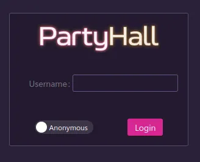

# Basic usage

Now that you have successfully installed PartyHall, let's see how to use it !

First, you will need to connect to the admin UI. To do so, be sure that your appliance is connected to the network and in your browser, go to its IP address.

:::tip
Not sure about the IP ? Press the Debug button on your appliance, the IP will be displayed on screen for 30s.
:::

You should then be able to log in. Press the `Anonymous` switch to login with your admin account.

## Creating your first event

You will need to create your first event. Let's go in the sidebar to the `Event` page and click `New`.

You can fill the fields `Name`, `Author`, `Date` and `Location`.

For the `Nexus ID` field you have two possibilities. This field should be a PartyNexus ID and will be used to synchronize everything.

If you haven't created the event on PartyNexus yet, just save with this field empty, and once created you can click it to create it on PartyNexus. The field will then be filled properly.

If you have already created the event, you can go on PartyNexus and show the event to get its ID

This means that if you have multiple appliances at a party, you can link them all to a single event on PartyNexus.

You are now ready to use the appliance!

## Selecting the event

By default, the first event created will be set as the default one.

If you create multiple events, like the second time you're using the appliance, you will need to select it otherwise it will keep taking pictures in the first event.

To do so, let's go on the `Events` page:

Click the use button, this will select the event and mark it as the new default.

The event that do not have the `Use` button is the currently selected one.