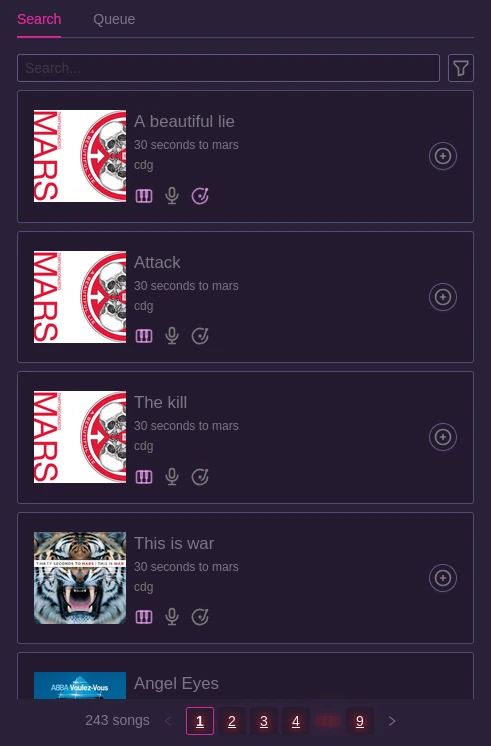
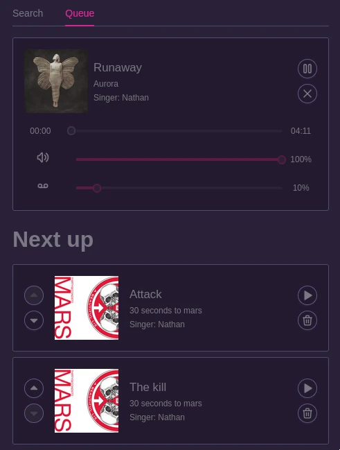

# Karaoke

The following part expects that you already setup your Nexus instance as explained [here](/docs/partynexus/karaoke/) and that songs are syncronized.

Any user going on the web ui can go in the `Karaoke` page and see the list of songs available.

From there, they will be able to start a song or add it to the queue.

In the queue tab, they will be able to see the currently playing song and reorder the queue and skip song.

From the same tab, they will also be able to choose the volume of both the instrumental and the vocals, it's recommended to keep the vocals low so that they help you sing but do not overtake the microphone volume.

