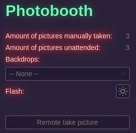

# Photobooth

The photobooth module aims to create a standalone photobooth to be used. It's the only required module as it's the core of PartyHall.

## Main usage

When pressing the physical button, a count down will be displayed and a picture will be taken. It will be displayed on the screen for a few seconds.

If you have a physical flash and you did enable it in the settings, it will be triggered. Otherwise you will have to rely on the screen flashing white.

:::warning
@TODO: Take video to demo the feature
:::

Note that while this is called a photobooth, it's not really one in the traditional meaning as there is no printer. This is not a short-coming but a design choice. Maybe at some point I will add the feature as an optional one but it's not planned yet.

## Unattended pictures

If the setting is enabled, the photobooth module will also take pictures by itself every few minutes.

Those will never be seen by themselves as they will be compiled as a timelapse when the event is over by PartyNexus.

While taking unattended pictures, the flash will not be triggered.

## Web UI

In the web ui, you can find a `Photobooth` page.

This contains the count of hand-taken pictures and the count of unattended pictures.

You can select there the backdrop album to be used and the currently selected backdrop.

You also have a button to take a picture that will be trigger just as if you pressed the physical button.

You also have a button to turn on or off the flash to test its brightness.

