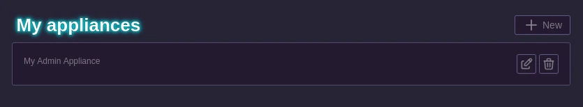

# Appliances

Each admin account can register appliances.

To do so, go to your account settings, in the administration page then in the appliance administration page.

From there you will be able to create an appliance.

This will give you a `Hardware ID` and a `Token` that should be added to the configuration of the PartyHall software on the specific appliance.

Note that this token should be kept secret as it enables anyone with access to it to manage every events you own.

