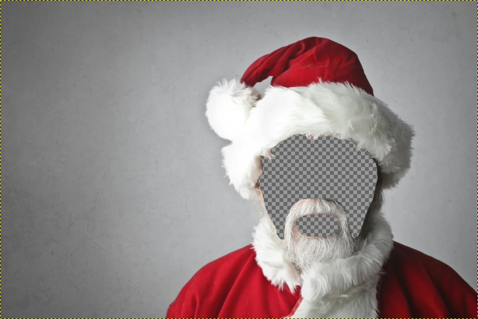
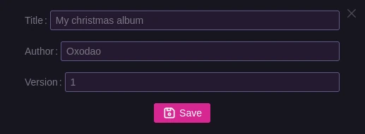
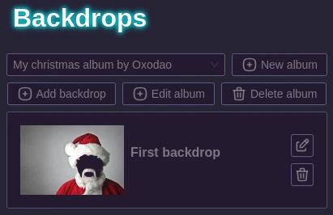

# Backdrops

Backdrops are pictures that will be displayed on top of the webcam, with holes for people to put their head.

With the press of a physical button, users will be able to cycle through each one.

They are grouped by "Albums".

## Prepare your pictures

First you need to prepare your backdrops. For this, take any picture that would be fitting and use Gimp or Photoshop to cut holes where you want the webcam feed to be visible, most likely the head of the persons / characters present in the original picture.

Save them as `.webp`. Keep in mind that the resolution of your image should match your screen / webcam resolution (Or be a multiple of it) !

Here's what it should look like (Note that the checkerboard is here just so that you see properly where the transparent part is but should obvisouly not be in the final image):

<figure>
    
    <figcaption>[Christmas man by Andrea Piacquadio](https://www.pexels.com/fr-fr/photo/homme-en-costume-de-pere-noel-716658/)</figcaption>
</figure>

## Creating an album

Let's go in PartyNexus' admin area and into the backdrop settings.

From there you will be able to create a new album, let's say "Christmas backdrops", in which you will then upload all those santa-themed backdrops previously prepared.

First we create the album:

Then you can add your backdrops in it after selecting it in the dropdown:

The appliance will then synchronize those albums, if you modify it be sure to bump the version so that the appliance knows it need to update it.

On the appliance webapp you can then select the album you want to be used.