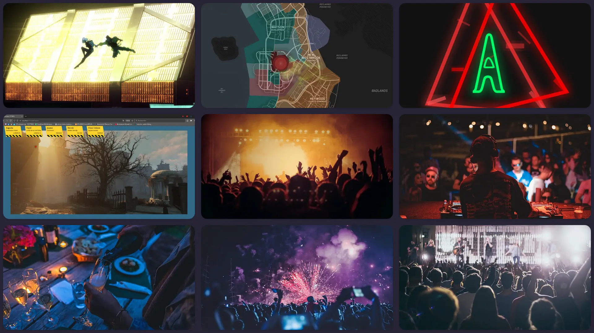
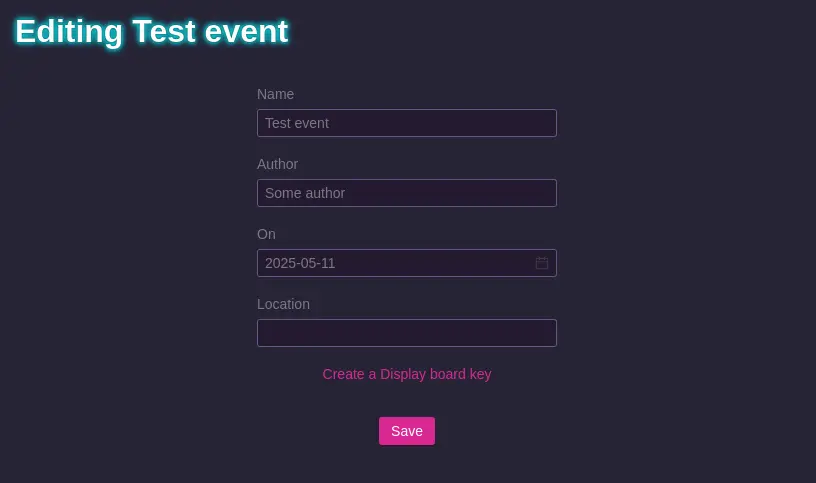
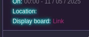

# Display board

You can make a "Display board". It's a link that you can open on a separate device (computer, tablet, TV, ...) to display the last 9 pictures that were taken by the appliance and show them.

Here's what it looks like:

To do so, go to your event's edition page and click the "Create display board key".

Once this is done, a new line will show in the event description with a link to the Display board:

Note that this link embeds in its URL the key to authorize the view. Anyone with this link will be able to see the last 9 pictures that were taken so be careful with it.