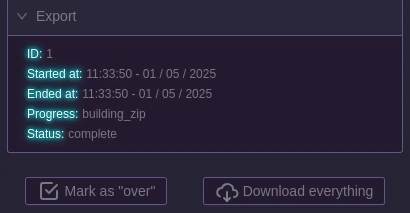

# Exports

Once the event is over and the appliance has sync'ed everything to PartyNexus, you will be able to `conclude` the event by going onto it and choosing `Mark as over`.

This will result in the following actions:
- Compiling every unattended pictures to a timelapse
- Making a zip file containing:
    - Every pictures hand-taken
    - The timelapse
    - A metadata json file containing informations about the event including the songs that were played in the karaoke
- Sending an email to participants to tell them that the timelapse is ready to be seen

This file will be available to download by your users and the timelapse will also be visible from the Web UI.

