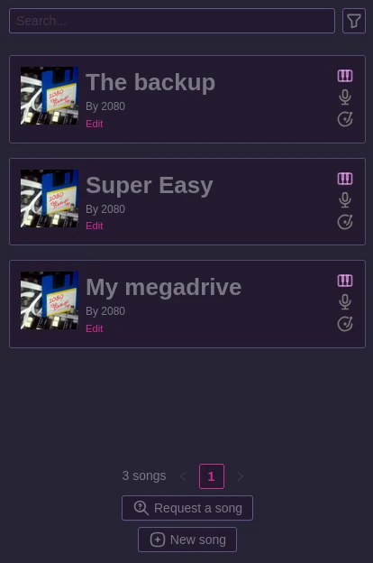
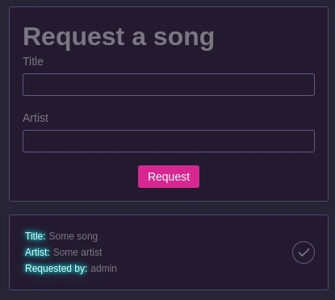

# How to use the Karaoke

What party would be complete without a karaoke ?

Let's set it up so that your appliance has all the songs required.

In the navbar you should see a `Karaoke` tab. This shows a listing of all the available songs which will be synchronised to your appliances.

## Requesting a song

In the Web UI, your user will be able to request a song they'd like for upcoming events.

They will fill the name of the track and its artist and you'll receive an email to let you know that you need to purchase the song and add it to the catalog. Note that all songs request are visible by anyone logged in.

## How song works

The songs can basically be in two state:
- Compiled
- Decompiled

A compiled song means the final `.phk` file will be listed on the main page and every user will see them. Those will also be able to be synchronised with your appliances.

A decompiled song means the song is extracted and is modifiable. Those song are not seen by the users nor the appliances.

When compiling a song, it generates a `Nexus UUID`. This is how the appliance knows whether it has the song synced or not. If you decompile and recompile a song, the appliance will see the song as missing and will remove old files to download it again.

## Adding a song

First, you need to purchase the song you want to add through a karaoke provider. Here are the most popular ones:

- [Karaoke Version](https://www.karaoke-version.com/karaoke/): Recomended, made by the same people that run Karafun, they provide `mp3+cdg` files or videos with a background (KFN files are **NOT** supported)
- [Sunfly](https://www.sunflykaraoke.com/)
- [Zoom Karaoke](https://zoom-entertainments.co.uk/)
- [Sing to the world](https://www.singtotheworld.com/)

Those provider gives you an instrumental version of the song (`.mp3`) alongside with the lyrics correctly synchronised (`.cdg`). PartyHall suports those pretty well.

The recomended format though, is `webm` video files with transparent background. Those are not sold so you might need to make them yourself. This takes a lot of time thus it's probably better for you to just buy the `CDG` file from one of the provider above.

Once you have the files ready, go to the nexus and in the `Karaoke` tab into "Create new song".

The format section is important, it defines whether the song you're adding is a `video` or a `mp3+cdg`.

Hotspot is currently unused as it was a previous feature that will maybe make a come-back on future versions, it is supposed to be the timecode in seconds of the most recognizable part of the song.

Press save and the song is created, you now need to fill the missing files.

First, you should set a cover, then you also need to specify each file that makes your song which are:
- `instrumental.mp3` (MP3+CDG only)
- `lyrics.cdg` (MP3+CDG only)
- `instrumental.webm` (Video only, should be a vp9 encoded video)
- `vocals.mp3` (The vocals of the song)

:::note
When buying the song on the platforms seen there, you will not have the vocals file.

It is optional and only to be used if you want to have a guidance while singing. It can be generated by using the original song with [Ultimate Vocals Remover](https://github.com/Anjok07/ultimatevocalremovergui).

Note that in order for the vocals and the instrumental to be in sync, you probably want to have the 3 files (Instrumental bought from a provider, full song, vocals only) open in Audacity and ensure that all three files are perfectly in sync. If that's not the case you need to cut some seconds / generate silence at the begining of the song on the vocals. Do not change the length of the instrumental or you will desync the CDG file !

To sync them properly, mute the vocals and try to make the full song's instruments to match the instrumental, then mute the instrumental to match the vocals with the full song. Finally, remove the instrumental and the full song and export your vocals properly sync'ed
:::

Once everything is ready, press the `Compile song` button. This will generate the `.phk` file and the song will be available for the appliances !