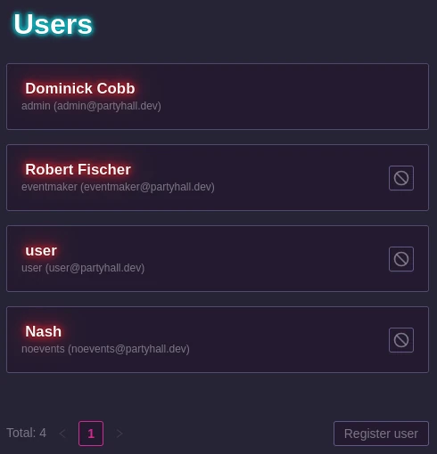
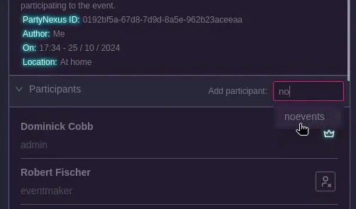

# User management

## Adding an administrator

As explained in the `Getting started` guide, you can create an administrator account with the following command:

```sh
$ docker compose exec bin/console user:create:admin [USERNAME] [EMAIL] [LANGUAGE]
```

Where language is one of:
- `en_US`
- `fr_FR`

Note that only administrators can have appliances !

## Adding a user

Currently, there is no way for a user to register by themselves.

You need, as an admin, to go to your account then `Admin` and click `User management`.



By default they won't have access to any event, this can be changed by going to the event, and in the `Participants` section type their username.



When a user is created, they will directly receive an email with their first magic link to authenticate.

## Authentication

Users can authenticate given one of those two methods:

- Magic link
- Password

The magic link is preferred as people tends to not bother too much with those kind of software.

If for some reason one of your user does not get the email (Probably because they have an hotmail email address), you as an admin, can generate a "Magic Password". Its a link that act like a magic link but will prompt the user to directly define a password so that they're autonomous afterward.